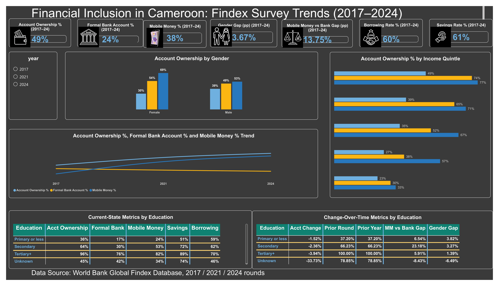

# 🇨🇲 Financial Inclusion in Cameroon — Findex Analysis (2017–2024)



## 📊 Overview

An interactive **Power BI dashboard** analyzing financial inclusion in Cameroon using the **World Bank Global Findex Database** (2017, 2021 & 2024).

The project explores:

- Account ownership
- Formal bank accounts
- Mobile money
- Savings & borrowing
- Gender differences
- Income groups
- Education levels
- Trends over time

## 🛠️ Tools

- **SQL** — Data analysis, filtering, aggregation and calculations
- **Power BI** — Data modeling, DAX, visualization and dashboard development

## 🔍 Key Insights

- Account ownership increased significantly between 2017 and 2024.
- Mobile money plays an important role in financial inclusion.
- Financial access varies considerably by income and education.
- Gender differences remain an important dimension of financial inclusion.

## 📂 Project Files

```text
Financial-Inclusion-Cameroon/
├── README.md
├── dashboard.png
├── sql/
│   └── financial_inclusion_analysis.sql
└── powerbi/
    └── Financial_Inclusion_Cameroon.pbix
